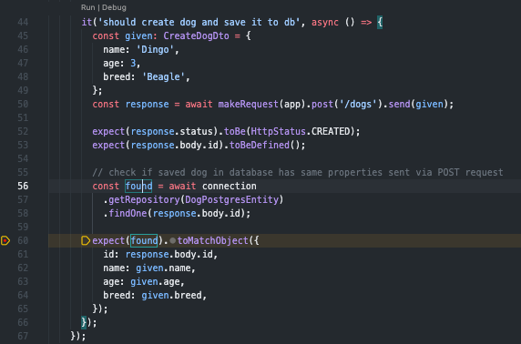

# Nest.js integration tests

TDD is really hype shortcut, but it's hard to follow this approach with only unit tests. The answer for this problem are integration tests .
Here I'll present you how to setup those tests with Nest.js framework and PostgresSQL database. Those tests will cover whole API request lifecycle, from controllers, services, dtos, repositories, database entities and much more...

## Github

Complex example https://github.com/olgierd1/nestjs-integration-tests.

## API setup

Basic endpoint which creates Dog and saves it in Postgres database:

##### Controller

Our entry-point which will listen for `POST` requests on `/dogs` path

```typescript
import { Body, Controller, Post } from '@nestjs/common';
import { DogsService } from './dogs.service';
import { CreateDogDto } from './dto/create-dog.dto';

@Controller('dogs')
export class DogsController {
  constructor(private readonly dogsService: DogsService) {}

  @Post()
  async create(@Body() createDogDto: CreateDogDto) {
    const created = await this.dogsService.create(createDogDto);

    return {
      id: created.id,
    };
  }
}
```

##### Service

This is the class which has injected connection to Postgres database and executes `save` query

```typescript
import { Injectable } from '@nestjs/common';
import { Connection } from 'typeorm';
import { DogPostgresEntity } from './database/dog.entity';
import { CreateDogDto } from './dto/create-dog.dto';

@Injectable()
export class DogsService {
  constructor(private connection: Connection) {}

  async create(createDogDto: CreateDogDto) {
    return this.connection.getRepository(DogPostgresEntity).save(createDogDto);
  }
}
```

##### Postgres entity

Definition of dog table in Postgres database

```typescript
import { Column, Entity, PrimaryGeneratedColumn } from 'typeorm';

@Entity()
export class DogPostgresEntity {
  @PrimaryGeneratedColumn()
  id: number;

  @Column({ type: 'varchar' })
  name: string;

  @Column({ type: 'int' })
  age: number;

  @Column({ type: 'varchar' })
  breed: string;
}
```

#### `dogs.module` imported in `app.module`

```typescript
import { Module } from '@nestjs/common';
import { TypeOrmModule } from '@nestjs/typeorm';
import { DogPostgresEntity } from './database/dog.entity';
import { DogsController } from './dogs.controller';
import { DogsService } from './dogs.service';

@Module({
  imports: [TypeOrmModule.forFeature([DogPostgresEntity])],
  controllers: [DogsController],
  providers: [DogsService],
})
export class DogsModule {}
```

## Test module setup

The most important part, where we'll cover all utils necessary for start writing integration tests for our Dog endpoint

### Setup Postgres with Docker Compose

1. Create `docker-compose.int.test.yml` at the root directory

```yml
version: '3.3'

services:
  int-postgres:
    container_name: int-postgres
    image: postgres
    ports:
      - 5432:5432
    env_file:
      - .int.env
```

2. Create `.int.env` file at the root directory where we will store database definition variables

```.env
POSTGRES_HOST=localhost
POSTGRES_USER=root
POSTGRES_PASSWORD=root
POSTGRES_DB=test-db
POSTGRES_PORT=5432
```

3. Create `Makefile` at the root directory with useful command

```Makefile
start-test-db:
	docker-compose -f docker-compose.int.test.yml up -d
```

4. Run `make start-test-db` command

```bash
$ make start-test-db
```

Now our testing database is running on port `5432`, to use our tests we need to create some helpful utils

### Setup test module

1. Create `test.module.ts` in `test` directory which will be used in every test file

```typescript
import { Module } from '@nestjs/common';
import { ConfigModule } from '@nestjs/config';
import { TypeOrmModule } from '@nestjs/typeorm';

@Module({
  imports: [
    ConfigModule.forRoot({
      envFilePath: '.int.env',
      isGlobal: true,
    }),
    TypeOrmModule.forRoot({
      type: 'postgres',
      host: process.env.POSTGRES_HOST,
      port: +process.env.POSTGRES_PORT,
      username: process.env.POSTGRES_USER,
      password: process.env.POSTGRES_PASSWORD,
      database: process.env.POSTGRES_DB,
      autoLoadEntities: true,
      entities: [process.cwd() + '/**/*.entity{.ts,.js}'],
      synchronize: true,
    }),
  ],
})
export class TestModule {}
```

As you can see here we are referring to our `.int.env` just to get values used for setting up connection with Postgres

2.  Create `create-test-app.util.ts` in `test/utils` directory

```typescript
import { DynamicModule, ForwardReference, Type } from '@nestjs/common';
import { NestExpressApplication } from '@nestjs/platform-express';
import { Test } from '@nestjs/testing';
import { Connection } from 'typeorm';
import { TestModule } from '../test.module';

type Imports = Array<
  Type<any> | DynamicModule | Promise<DynamicModule> | ForwardReference
>;

interface TestApp {
  connection: Connection;
  app: NestExpressApplication;
}

export async function createTestApp(imports: Imports): Promise<TestApp> {
  const testingModule = await Test.createTestingModule({
    imports: [TestModule, ...imports],
  }).compile();

  const app = await testingModule
    .createNestApplication<NestExpressApplication>()
    .init();

  const connection = testingModule.get<Connection>(Connection);
  return {
    app,
    connection,
  };
}
```

What is happening here ? We are creating `testingModule` which is combination of `TestModule` created in previous step and modules passed via function arguments, based on that module we can create our `NestExpressApplication` and get connection to Postgres database.

3. Let's create last two utils which will be used in tests:

`test/utils/clear-all-tables.ts`

```typescript
import { Connection } from 'typeorm';

export const clearAllTables = async (connection: Connection): Promise<void> => {
  await Promise.all(
    connection.entityMetadatas.map(({ name }) => {
      return connection.createQueryBuilder().delete().from(name).execute();
    }),
  );
};
```

This one will be triggered after every test providing to have database in the same state before every test case

`test/utils/make-request.ts`

```typescript
import { INestApplication } from '@nestjs/common';
import * as request from 'supertest';

export function makeRequest(app: INestApplication) {
  return request(app.getHttpServer());
}
```

This one will be used to make HTTP request to our API in tests

### Let's create our first integration test

```typescript
import { HttpStatus } from '@nestjs/common';
import { NestExpressApplication } from '@nestjs/platform-express';
import { Connection } from 'typeorm';
import { clearAllTables } from '../../test/utils/clear-all-tables.util';
import { createTestApp } from '../../test/utils/create-test-app.util';
import { DogsModule } from './dogs.module';

describe('Dogs module', () => {
  let app: NestExpressApplication;
  let connection: Connection;

  beforeAll(async () => {
    const testApp = await createTestApp([DogsModule]);

    connection = testApp.connection;
    app = testApp.app;
  });

  afterEach(async () => {
    await clearAllTables(connection);
  });

  afterAll(async () => {
    await connection.close();
    await app.close();
  });
});
```

What is happening here ?
`beforeAll` - we are creating our application with `createTestApp` which returns connection to database and `express` application

`afterEach` - after every `it` we want to have the same state of database, so our tables needs to be empty

`afterAll` - we need to remember to close connection to database and close `express` app

Now we can add test scenarios for success respons in `POST /dogs` endpoint

```typescript
describe('Dogs module', () => {
  let app: NestExpressApplication;
  let connection: Connection;

  beforeAll(async () => {
    const testApp = await createTestApp([DogsModule]);

    connection = testApp.connection;
    app = testApp.app;
  });

  afterEach(async () => {
    await clearAllTables(connection);
  });

  afterAll(async () => {
    await connection.close();
    await app.close();
  });

  describe('POST /dogs', () => {
    describe('201', () => {
      it('should create dog and return id', async () => {
        const response = await makeRequest(app).post('/dogs').send({
          name: 'Dingo',
          age: 3,
          breed: 'Beagle',
        });

        expect(response.status).toBe(HttpStatus.CREATED);
        expect(response.body.id).toBeDefined();
      });

      it('should create dog and save it to db', async () => {
        const given: CreateDogDto = {
          name: 'Dingo',
          age: 3,
          breed: 'Beagle',
        };

        const response = await makeRequest(app).post('/dogs').send(given);

        expect(response.status).toBe(HttpStatus.CREATED);
        expect(response.body.id).toBeDefined();

        // check if saved dog in database has same properties sent via POST request
        const found = await connection
          .getRepository(DogPostgresEntity)
          .findOne(response.body.id);

        expect(found).toMatchObject({
          id: response.body.id,
          name: given.name,
          age: given.age,
          breed: given.breed,
        });
      });
    });
  });
});
```

As you can see in every `it` we are making HTTP call to our API and then we can check the most important stuff - database changes and API responses. Thanks to such a approach we can test more complex endpoints which refers with multiple tables.

### For VSCode users

If you don't want to run all test cases at once you can install [Jest Runner](https://marketplace.visualstudio.com/items?itemName=firsttris.vscode-jest-runner). Thanks to that it's really easy to debug every test case separately

